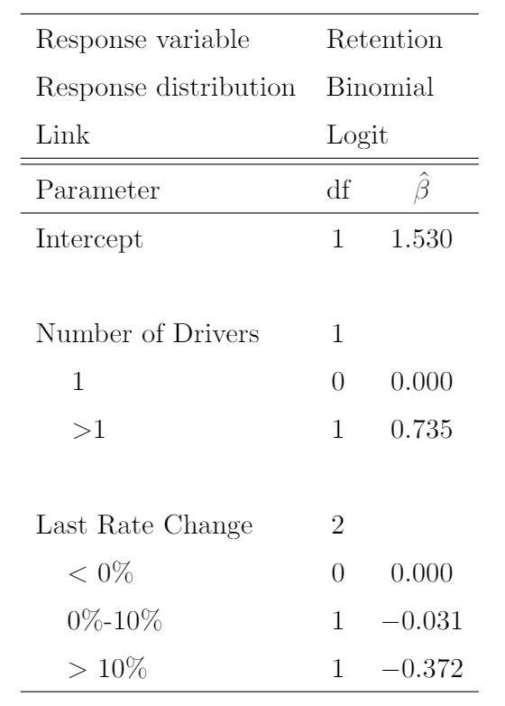
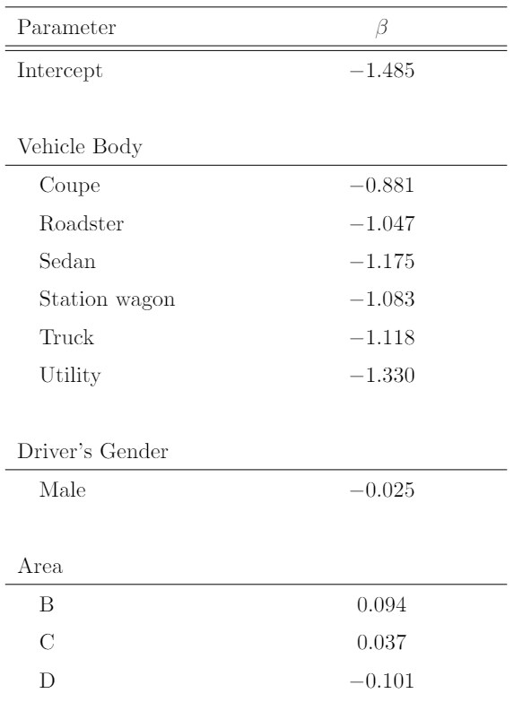
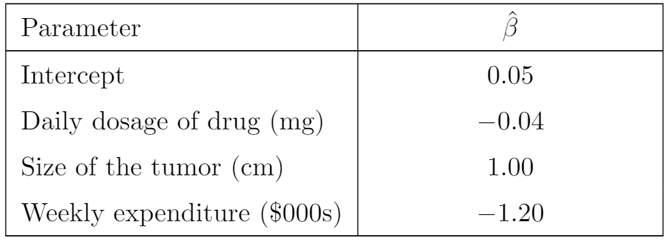

------------------------------------------------------------------------

**Submission**: Screenshot your written answers. 

------------------------------------------------------------------------

### Question 1.

You are given the following information for a GLM of customer retention

{width="45%"}

Calculate the probability of retention for a policy with 3 drivers and a prior rate changes of 5%.

### Question 2.

You are given the following information for a GLM to estimate the probability of claim. Distribution selected is Binomial (Bernoulli) and the link function is logit.

{width="55%"}

Calculate the estimated probability of claim for

-   Driver Gender: Female
-   Vehicle Body: Sedan
-   Area: D

### Question 3.

You are given the following output from a logistic regression to estimate the probability of death cancer patients.

{width="55%"}

Calculate the estimated probability of death for a patient who has a tumor of 2cm, spends \$780 on medical treatment and 10mg of drug is injected everyday.

