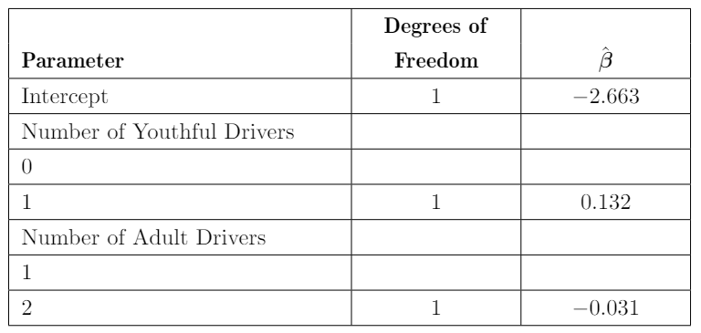
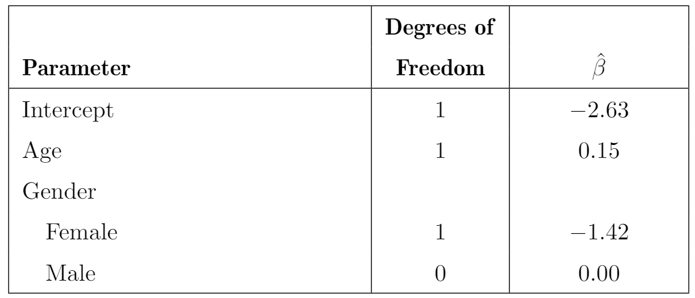

------------------------------------------------------------------------

**Submission**: Submit the knitted word document to Canvas.  

------------------------------------------------------------------------

## Calculations

**Problem 1**

You are given the following for a model of vehicle claim counts by policy

-   The response distribution is Poisson and the link function is a log link function

-   The parameters are given as follows.

{width="80%"}

Calculate the predicted claim count for a policy with one adult driver and one youthful driver.


------------------------------------------------------------------------

**Problem 2**

You are given the follow.

{width="60%"}

Calculate the predicted number deaths for a population of 100,000 females age 25


------------------------------------------------------------------------

**Problem 3**

You are given the follow result of a Poisson Regression where the response is the total number of claims for a risk group. Calculate the estimated total number of claims for a risk group consisting of 2,000 female aged 25.

{width="60%"}

## R - Programming

-   Poisson Regression is another popular special case of GLM. The response in Poisson regression is a counting number (0, 1, 2,...). To demonstrate Poisson regression, we will bring in a new dataset.

[Dataset](poisson_sim2.csv)

In this data, we will use the `num_awards` (the number of awards earned by students at a high school) as the response. The predictors are `math`, students' scores on their math final exam, and `prog`, the type of program in which the students were enrolled.


::: {.cell}

```{.r .cell-code}
d = read.csv('poisson_sim2.csv')

model = glm(num_awards ~ prog + math, 
            data = d,
            family = poisson(link = "log"))
summary(model)
```
:::


-   Now, let's predict the number of award of a student scoring 70 for `math` and enrolling `Vocational` program


::: {.cell}

```{.r .cell-code}
predict(model, 
        list(math = 70, prog = "Vocational"), 
        type = 'response')
```
:::


-   We can calculate the p-value of the goodness of fit test for this model as follows.


::: {.cell}

```{.r .cell-code}
# Goodness-of-fit test
gof.pvalue = 1 - pchisq(model$deviance, model$df.residual)
gof.pvalue
```
:::


We observe that with this large p-value, the model does not fit the data well.

**Questions:**  Find a dataset that has a counting variable to train a Poisson regression on. Train a Poisson regression with the data. Give the model summary. Make a prediction with the model. Report the p-value of the Goodness of fit test for the model.

