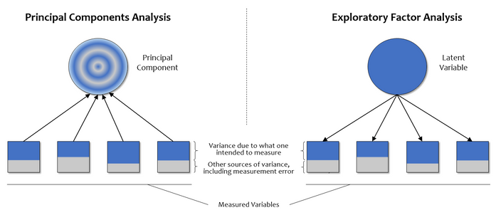

---
title: "Factor Analysis"
author: <font size="5"> Son Nguyen </font>
output:
  xaringan::moon_reader:
    css: [default, metropolis, metropolis-fonts]
    lib_dir: libs
    nature:
      highlightStyle: github
      highlightLines: true
      countIncrementalSlides: false
      slideNumberFormat: |
        <div class="progress-bar-container">
          <div class="progress-bar" style="width: calc(%current% / %total% * 100%);">
          </div>
        </div>`
---

<style>

.remark-slide-content {
  background-color: #FFFFFF;
  border-top: 80px solid #F9C389;
  font-size: 17px;
  font-weight: 300;
  line-height: 1.5;
  padding: 1em 2em 1em 2em
}

.inverse {
  background-color: #696767;
  border-top: 80px solid #696767;
  text-shadow: none;
  background-image: url(https://github.com/goodekat/presentations/blob/master/2019-isugg-gganimate-spooky/figures/spider.png?raw=true);
	background-position: 50% 75%;
  background-size: 150px;
}

.your-turn{
  background-color: #8C7E95;
  border-top: 80px solid #F9C389;
  text-shadow: none;
  background-image: url(https://github.com/goodekat/presentations/blob/master/2019-isugg-gganimate-spooky/figures/spider.png?raw=true);
	background-position: 95% 90%;
  background-size: 75px;
}

.title-slide {
  background-color: #F9C389;
  border-top: 80px solid #F9C389;
  background-image: none;
}

.title-slide > h1  {
  color: #111111;
  font-size: 40px;
  text-shadow: none;
  font-weight: 400;
  text-align: left;
  margin-left: 15px;
  padding-top: 80px;
}
.title-slide > h2  {
  margin-top: -25px;
  padding-bottom: -20px;
  color: #111111;
  text-shadow: none;
  font-weight: 300;
  font-size: 35px;
  text-align: left;
  margin-left: 15px;
}
.title-slide > h3  {
  color: #111111;
  text-shadow: none;
  font-weight: 300;
  font-size: 25px;
  text-align: left;
  margin-left: 15px;
  margin-bottom: -30px;
}

</style>

```{css, echo=FALSE}
.left-code {
  color: #777;
  width: 48%;
  height: 92%;
  float: left;
}
.right-plot {
  width: 51%;
  float: right;
  padding-left: 1%;
}
```

```{r setup, include = FALSE}
#R markdown options
knitr::opts_chunk$set(echo = TRUE, 
                      eval = TRUE,
                      fig.width = 10,
                      fig.height = 5,
                      fig.align = "center", 
                      message = FALSE,
                      warning = FALSE)

#Load packages
library(tidyverse)
```




---

```{r}
library(tidyverse)
df = read_csv('FactorAnalysis.csv')

fa = factanal(df, factors = 4)
```

---

```{r}
fa$loadings
```

---
# Loadings

- The loadings are the contribution of each original variable to the factor

- Variables with a high loading are well explained by the factor


---

```{r}
fa$uniquenesses
```

---
# Uniquenesses

- Uniquenesses: Uniqueness is the variance that is 'unique' to the variable and not shared with other variables

- Uniqueness sometimes referred to as noise

- The greater 'uniqueness' the lower the relevance of the variable in the factor model

- Values more than 0.6 are usually considered high


---

```{r}
df <- read_csv("https://userpage.fu-berlin.de/soga/data/raw-data/food-texture.csv")
df = df[,c(2:6)]
food_fa <- factanal(df, factors = 2)
```

---

```{r}
food_fa
```


```{r, eval=FALSE, echo=FALSE}
n <- 100
R <- matrix(c(1, 0.8, .9 , 0, 0, 0,
              .8, 1,  .9 , 0, 0, 0,
              .9, 0.9, 1 , 0, 0, 0,
              0,  0,   0 , 1, 0.8,  .9,
              0,  0,   0 , .8, 1, .9,
              0,  0,   0 , .9, .9, 1), 
            nrow = 6, ncol = 6, byrow = TRUE)
            
mu <- c(Tennis = 100, Table_tennis = 100, Pickle_ball = 100, Soccer = 100, Football = 100, Baseball = 100)
df = as_tibble(mvtnorm::rmvnorm(n, mean = mu, sigma = R))
factanal(df, 2)
```

