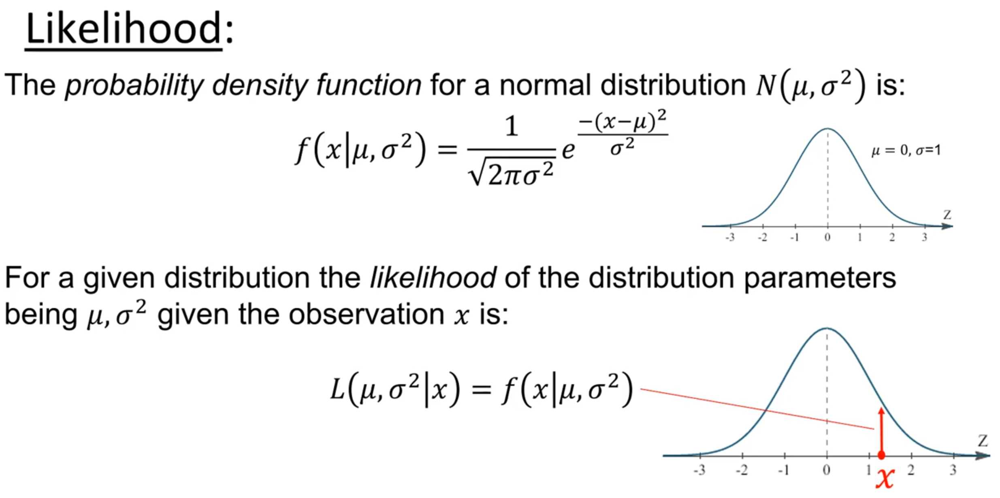

---
title: "Linear Discriminant Analysis (1)"
author: <font size="5"> Son Nguyen </font>
output:
  xaringan::moon_reader:
    css: [default, metropolis, metropolis-fonts]
    lib_dir: libs
    nature:
      highlightStyle: github
      highlightLines: true
      countIncrementalSlides: false
      slideNumberFormat: |
        <div class="progress-bar-container">
          <div class="progress-bar" style="width: calc(%current% / %total% * 100%);">
          </div>
        </div>`
---

<style>

.remark-slide-content {
  background-color: #FFFFFF;
  border-top: 80px solid #F9C389;
  font-size: 17px;
  font-weight: 300;
  line-height: 1.5;
  padding: 1em 2em 1em 2em
}

.inverse {
  background-color: #696767;
  border-top: 80px solid #696767;
  text-shadow: none;
  background-image: url(https://github.com/goodekat/presentations/blob/master/2019-isugg-gganimate-spooky/figures/spider.png?raw=true);
	background-position: 50% 75%;
  background-size: 150px;
}

.your-turn{
  background-color: #8C7E95;
  border-top: 80px solid #F9C389;
  text-shadow: none;
  background-image: url(https://github.com/goodekat/presentations/blob/master/2019-isugg-gganimate-spooky/figures/spider.png?raw=true);
	background-position: 95% 90%;
  background-size: 75px;
}

.title-slide {
  background-color: #F9C389;
  border-top: 80px solid #F9C389;
  background-image: none;
}

.title-slide > h1  {
  color: #111111;
  font-size: 40px;
  text-shadow: none;
  font-weight: 400;
  text-align: left;
  margin-left: 15px;
  padding-top: 80px;
}
.title-slide > h2  {
  margin-top: -25px;
  padding-bottom: -20px;
  color: #111111;
  text-shadow: none;
  font-weight: 300;
  font-size: 35px;
  text-align: left;
  margin-left: 15px;
}
.title-slide > h3  {
  color: #111111;
  text-shadow: none;
  font-weight: 300;
  font-size: 25px;
  text-align: left;
  margin-left: 15px;
  margin-bottom: -30px;
}

</style>

```{css, echo=FALSE}
.left-code {
  color: #777;
  width: 48%;
  height: 92%;
  float: left;
}
.right-plot {
  width: 51%;
  float: right;
  padding-left: 1%;
}
```

```{r setup, include = FALSE}
#R markdown options
knitr::opts_chunk$set(echo = TRUE, 
                      eval = TRUE,
                      fig.width = 10,
                      fig.height = 5,
                      fig.align = "center", 
                      message = FALSE,
                      warning = FALSE)

#Load packages
library(tidyverse)
```

# Classification Problem

- Given a dataset that has $x$ and $y$ (class or label)


```{r, eval=TRUE, echo=FALSE}
library(knitr)
set.seed(2024)
n1 = 4
n2 = 6
x1 = rnorm(n = n1, mean = 1, sd = .5)
df1 = as_tibble(list(x = x1, y = 1))

x2 = rnorm(n = n2, mean = 2, sd = .5)
df2 = as_tibble(list(x = x2, y = 2))

df = rbind(df1, df2)
p = df %>% ggplot()+geom_histogram(aes(x = x, fill = as.factor(y)))
kable(round(df,2))
```

- Given a new value $x$, what class the it belongs to? (what is the predicted $y$ value)

- If $x = 1.4$, what is its associated $y$ value? (What class it belongs to?)

---
# Approach

- We will estimate two probabilities  $p_1 = P(y =  1|x = 1.4)$ and $p_2 = P(y =  2|x = 1.4)$.

- If $p_1 > p_2$, we will classify the new point to class 1 and vice versa.

---
# Approach

We have, using the Bayes' Rule, 

$$p_1 = P(y = 1|x = 1.4) = \frac{P(y = 1)*L(x=1.4|y=1)}{L(x=1.4)}$$
where L(A) denotes the likelihood of the event A. Similarly, 


$$p_2 = P(y = 2|x = 1.4) = \frac{P(y = 2)*L(x=1.4|y=1)}{L(x=1.4)}$$
Since the denominator is the same we just need to compare the numerator. 

---
# LDA Assumptions

- $x$ is normally distributed in each class

- Assume that $x$ has the same variance in both classes

---




---
# Calculation


---
# Calculation

```{r, eval=FALSE, echo=FALSE}
# wrong
f = function(x, mu, sigma)
{
  e = exp(1)
  (1/(sigma*(sqrt(2*pi))))*e^(-((x-mu)^2)/(sigma^2))
}
```

https://planetcalc.com/4986/

https://www.standarddeviationcalculator.io/normal-distribution-calculator


---
# Decision Boundary

- The decision boundary is where $p_1 = p_2$

- Thus, 

\begin{align*}
&\frac{P(y = 1)*L(x=x_0|y=1)}{L(x=x_0)}&=\frac{P(y = 2)*L(x=x_0|y=1)}{L(x=x_0)} \\
\implies&P(y = 1)*L(x=x_0|y=1)&=P(y = 2)*L(x=x_0|y=1) \\
\implies&\pi_1*L(x=x_0|y=1)&=\pi_2*L(x=x_0|y=1) \\
\implies&\pi_1*f(x_0| \mu_1, \sigma^2)&=\pi_2*f(x_0| \mu_2, \sigma^2)\\
\implies&\pi_1*\frac{1}{\sqrt{2\pi\sigma_1^2}}e^{-(x_0-\mu_1)^2/(2\sigma^2)}&=\pi_2*\frac{1}{\sqrt{2\pi\sigma_2^2}}e^{-(x_0-\mu_2)^2/(2\sigma^2)}\\
\implies&\pi_1*\frac{1}{\sigma_1^2}e^{-(x_0-\mu_1)^2/(2\sigma^2)}&=\pi_2*\frac{1}{\sigma_2^2}e^{-(x_0-\mu_2)^2/(2\sigma^2)}\\
\implies2x_0&=\mu_1 + \mu_2 + \frac{2\sigma^2(\ln\pi_2 - \ln\pi_1)}{\mu_1-\mu_2}
\end{align*}

```{r, eval=FALSE, echo=FALSE}
u1 = 1.14
u2 = 2.04
pi1 = .4
pi2 =.6
s = .55

(u1 + u2 +2*(s^2)*(log(pi2)-log(pi1))/(u1-u2))/2
```


---
# 

