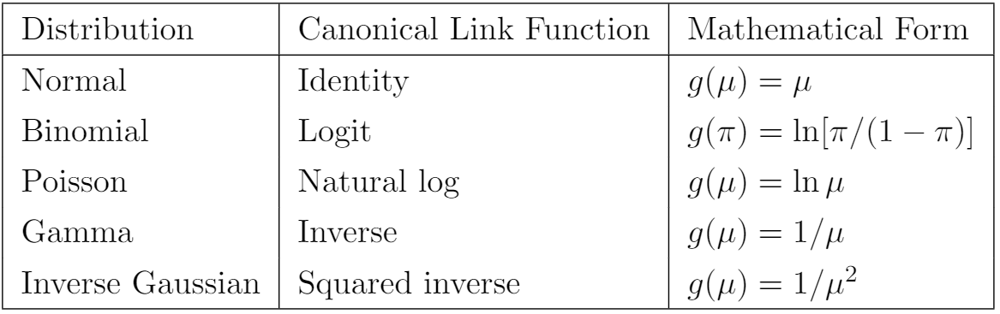

---
title: "Generalized Linear Models"
author: <font size="5"> Son Nguyen </font>
output:
  xaringan::moon_reader:
    css: [default, metropolis, metropolis-fonts]
    lib_dir: libs
    nature:
      highlightStyle: github
      highlightLines: true
      countIncrementalSlides: false
      slideNumberFormat: |
        <div class="progress-bar-container">
          <div class="progress-bar" style="width: calc(%current% / %total% * 100%);">
          </div>
        </div>`
---

<style>

.remark-slide-content {
  background-color: #FFFFFF;
  border-top: 80px solid #F9C389;
  font-size: 17px;
  font-weight: 300;
  line-height: 1.5;
  padding: 1em 2em 1em 2em
}

.inverse {
  background-color: #696767;
  border-top: 80px solid #696767;
  text-shadow: none;
  background-image: url(https://github.com/goodekat/presentations/blob/master/2019-isugg-gganimate-spooky/figures/spider.png?raw=true);
	background-position: 50% 75%;
  background-size: 150px;
}

.your-turn{
  background-color: #8C7E95;
  border-top: 80px solid #F9C389;
  text-shadow: none;
  background-image: url(https://github.com/goodekat/presentations/blob/master/2019-isugg-gganimate-spooky/figures/spider.png?raw=true);
	background-position: 95% 90%;
  background-size: 75px;
}

.title-slide {
  background-color: #F9C389;
  border-top: 80px solid #F9C389;
  background-image: none;
}

.title-slide > h1  {
  color: #111111;
  font-size: 40px;
  text-shadow: none;
  font-weight: 400;
  text-align: left;
  margin-left: 15px;
  padding-top: 80px;
}
.title-slide > h2  {
  margin-top: -25px;
  padding-bottom: -20px;
  color: #111111;
  text-shadow: none;
  font-weight: 300;
  font-size: 35px;
  text-align: left;
  margin-left: 15px;
}
.title-slide > h3  {
  color: #111111;
  text-shadow: none;
  font-weight: 300;
  font-size: 25px;
  text-align: left;
  margin-left: 15px;
  margin-bottom: -30px;
}

</style>

```{css, echo=FALSE}
.left-code {
  color: #777;
  width: 48%;
  height: 92%;
  float: left;
}
.right-plot {
  width: 51%;
  float: right;
  padding-left: 1%;
}
```

```{r setup, include = FALSE}

# R markdown options
knitr::opts_chunk$set(echo = TRUE, 
                      
                      fig.width = 10,
                      fig.height = 5,
                      fig.align = "center", 
                      message = FALSE,
                      warning = FALSE)

# Load packages
library(tidyverse)
```


# Generalized Linear Model

-   The GLM models $\mu = E(y)$ as follows. $$
    g(\mu) = \beta_0 + \beta_1x_1+...+\beta_px_p = x'\beta 
    $$ where $y$ is assumed to follow an exponential distribution family.

-   Exponential distribution family includes all the basic distribution such as normal distribution, binomial distribution, Poisson distribution...

-   $g(\mu)$ is called the canonical link function

-   For logistic regression, the link function is a logit function $$g(x) = \ln\bigg(\frac{x}{1-x}\bigg)$$

---
# Some GLMs

$$
    g(\mu) = \beta_0 + \beta_1x_1+...+\beta_px_p = x'\beta 
    $$



---
# Two Elements of GLM

- Response Assumptions

- Link Function

---
# Goodness of Fit: Deviance

- The deviance generalizes the Residual Sum of Squares (RSS) of the linear model

-  Compare three models

- Model 1: The Perfect Model (Saturated Model)

- Model 2: Your model

- Model 3: The worst model: does not use any predictors. Also called Null Model. 

- The deviance can be considered the "distance" of the model to the perfect model. 

- The smaller the deviance the better the model

- Deviance 0 means the model is perfect!

- The deviance of Model 3 is also called Null Deviance. 

- $R^2 = 1- \frac{\text{Deviance of your model}}{\text{Deviance of the perfect model}}$

---
# Goodness of Fit: The Loglikelihood

- The loglikelihood of a model measures how likely the data is governed by the model. 

- The higher the loglikelihood value, the better the model. 

- Adding varibles to the models will increase the loglikelihood of the model. 

---
# Goodness of Fit: AIC

- AIC = Akaike information criterion

- AIC = 2k - 2 * loglikelihood of the model. 

- Smaller AIC means larger loglikelihood, or better model

---
# Goodness of Fit: BIC

- BIC = Bayesian information criterion


- BIC = k ln(n) - 2 * loglikelihood of the model. 

- Smaller BIC means larger loglikelihood, or better model


