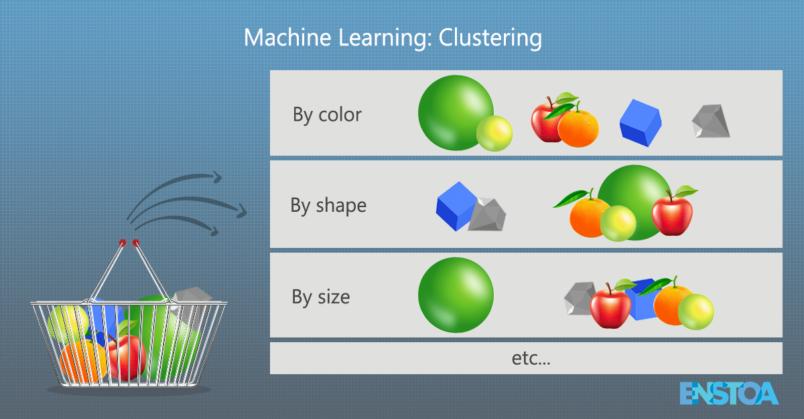

---
title: "K-means Clustering"
author: <font size="5"> Son Nguyen </font>
output:
  xaringan::moon_reader:
    css: [default, metropolis, metropolis-fonts]
    lib_dir: libs
    nature:
      highlightStyle: github
      highlightLines: true
      countIncrementalSlides: false
      slideNumberFormat: |
        <div class="progress-bar-container">
          <div class="progress-bar" style="width: calc(%current% / %total% * 100%);">
          </div>
        </div>`
---

<style>

.remark-slide-content {
  background-color: #FFFFFF;
  border-top: 80px solid #F9C389;
  font-size: 17px;
  font-weight: 300;
  line-height: 1.5;
  padding: 1em 2em 1em 2em
}

.inverse {
  background-color: #696767;
  border-top: 80px solid #696767;
  text-shadow: none;
  background-image: url(https://github.com/goodekat/presentations/blob/master/2019-isugg-gganimate-spooky/figures/spider.png?raw=true);
	background-position: 50% 75%;
  background-size: 150px;
}

.your-turn{
  background-color: #8C7E95;
  border-top: 80px solid #F9C389;
  text-shadow: none;
  background-image: url(https://github.com/goodekat/presentations/blob/master/2019-isugg-gganimate-spooky/figures/spider.png?raw=true);
	background-position: 95% 90%;
  background-size: 75px;
}

.title-slide {
  background-color: #F9C389;
  border-top: 80px solid #F9C389;
  background-image: none;
}

.title-slide > h1  {
  color: #111111;
  font-size: 40px;
  text-shadow: none;
  font-weight: 400;
  text-align: left;
  margin-left: 15px;
  padding-top: 80px;
}
.title-slide > h2  {
  margin-top: -25px;
  padding-bottom: -20px;
  color: #111111;
  text-shadow: none;
  font-weight: 300;
  font-size: 35px;
  text-align: left;
  margin-left: 15px;
}
.title-slide > h3  {
  color: #111111;
  text-shadow: none;
  font-weight: 300;
  font-size: 25px;
  text-align: left;
  margin-left: 15px;
  margin-bottom: -30px;
}

</style>

```{css, echo=FALSE}
.left-code {
  color: #777;
  width: 48%;
  height: 92%;
  float: left;
}
.right-plot {
  width: 51%;
  float: right;
  padding-left: 1%;
}
```

```{r setup, include = FALSE}

# R markdown options
knitr::opts_chunk$set(echo = FALSE, 
                      
                      fig.width = 10,
                      fig.height = 5,
                      fig.align = "center", 
                      message = FALSE,
                      warning = FALSE)

# Load packages
library(tidyverse)
```


# What is clustering?

Clustering is grouping data points into groups where data points in one group are `similar` to each other.

---
# What is clustering?



---
# Methods of Clustering

We will cover two clustering methods:

-   K-means clustering and
-   Hierarchical clustering

---
# K-means Clustering

-   Data

-   Visualize Data

-   Result of K-means clustering

---
# Step 1

```{r}
library(tidyverse)
library(ggplot2)

euc.dist = function(x1, x2){sqrt(sum((x1 - x2) ^ 2))}

# Use this example for non-unique solution
# d1 = as_tibble(data.frame(
#   x1 = c(1, 2, 3, 4, 15, 10, 11, 11, 12, 15, 11, 10, 20, 30, 25, 22, 29, 20, 31, 44, 17, 18, 19, 20), 
#   x2 = c(5, 6, 8, 8, 4,  20, 22, 27, 30, 23, 10, 15, 33, 44, 19, 14, 19, 22, 19, 20, 44, 11, 22, 37)))

d1 = as_tibble(data.frame(
  x1 = c(1:10, 31:40), 
  x2 = c(10, 7, 8, 5, 12, 2, 5, 7, 9, 7, 20, 22, 40, 19, 33, 27, 26, 18, 31, 37)))


ggplot(data = d1)+
  geom_point(aes(x=x1, y=x2))+ 
  coord_fixed()
```

---
# Step 1: Randomly select centroids

```{r}
set.seed(2023)
#set.seed(2022)
i = sample(c(1:nrow(d1)), 2)

centroid1 = d1[i[1],]
centroid2 = d1[i[2],]
centroid = rbind(centroid1, centroid2)

ggplot(data = d1)+
  geom_point(aes(x=x1, y=x2))+
  # geom_point(data = centroid, aes(x=x1, y=x2), size = 5)+ 
  coord_fixed()
```

---
# Step 1: Collect points for each clusters

```{r}

d1$Distance_to_centroid_1 = apply(d1, 1, euc.dist, x2 = centroid1)
d1$Distance_to_centroid_2 = apply(d1, 1, euc.dist, x2 = centroid2)

d1$Cluster = as.factor(as.numeric(d1$Distance_to_centroid_1 > d1$Distance_to_centroid_2 )+1)

ggplot(data = d1)+
  geom_point(aes(x=x1, y=x2, color = Cluster))+
  # geom_point(data = centroid, aes(x=x1, y=x2), size = 5)+ 
  coord_fixed()
```

---
# Locate centroids

```{r}
centroid = d1 %>% select(x1, x2, Cluster) %>% group_by(Cluster) %>% summarise_all(mean)

centroid1 = centroid[1,] %>% select(x1, x2)
centroid2 = centroid[2,] %>% select(x1, x2)

ggplot(data = d1)+
  geom_point(aes(x=x1, y=x2, color = Cluster))+
  geom_point(data = centroid, aes(x=x1, y=x2), size = 5)+ 
  coord_fixed()
```

---
# Collect points for each clusters

```{r}
d1 = d1 %>% select(x1, x2)

d1$Distance_to_centroid_1 = apply(d1, 1, euc.dist, x2 = centroid1)
d1$Distance_to_centroid_2 = apply(d1, 1, euc.dist, x2 = centroid2)

d1$Cluster = as.factor(as.numeric(d1$Distance_to_centroid_1 > d1$Distance_to_centroid_2 )+1)


ggplot(data = d1)+
  geom_point(aes(x=x1, y=x2, color = Cluster))+
  geom_point(data = centroid, aes(x=x1, y=x2), size = 5)+ 
  coord_fixed()
```

---
# Relocate centroids

```{r}
centroid = d1 %>% select(x1, x2, Cluster) %>% group_by(Cluster) %>% summarise_all(mean)

centroid1 = centroid[1,] %>% select(x1, x2)
centroid2 = centroid[2,] %>% select(x1, x2)

ggplot(data = d1)+
  geom_point(aes(x=x1, y=x2, color = Cluster))+
  geom_point(data = centroid, aes(x=x1, y=x2), size = 5)+ 
  coord_fixed()
```

---
# Collect points for each clusters

```{r}
d1 = d1 %>% select(x1, x2)

d1$Distance_to_centroid_1 = apply(d1, 1, euc.dist, x2 = centroid1)
d1$Distance_to_centroid_2 = apply(d1, 1, euc.dist, x2 = centroid2)

d1$Cluster = as.factor(as.numeric(d1$Distance_to_centroid_1 > d1$Distance_to_centroid_2 )+1)


ggplot(data = d1)+
  geom_point(aes(x=x1, y=x2, color = Cluster))+
  geom_point(data = centroid, aes(x=x1, y=x2), size = 5)+ 
  coord_fixed()
```

---
# Relocate centroids

```{r}
centroid = d1 %>% select(x1, x2, Cluster) %>% group_by(Cluster) %>% summarise_all(mean)

centroid1 = centroid[1,] %>% select(x1, x2)
centroid2 = centroid[2,] %>% select(x1, x2)

ggplot(data = d1)+
  geom_point(aes(x=x1, y=x2, color = Cluster))+
  geom_point(data = centroid, aes(x=x1, y=x2), size = 5)+ 
  coord_fixed()
```

---
# Collect points for each clusters

```{r}
d1 = d1 %>% select(x1, x2)

d1$Distance_to_centroid_1 = apply(d1, 1, euc.dist, x2 = centroid1)
d1$Distance_to_centroid_2 = apply(d1, 1, euc.dist, x2 = centroid2)

d1$Cluster = as.factor(as.numeric(d1$Distance_to_centroid_1 > d1$Distance_to_centroid_2 )+1)


ggplot(data = d1)+
  geom_point(aes(x=x1, y=x2, color = Cluster))+
  geom_point(data = centroid, aes(x=x1, y=x2), size = 5)+ 
  coord_fixed()
```

---
# Relocate centroids

```{r}
centroid = d1 %>% select(x1, x2, Cluster) %>% group_by(Cluster) %>% summarise_all(mean)

centroid1 = centroid[1,] %>% select(x1, x2)
centroid2 = centroid[2,] %>% select(x1, x2)

ggplot(data = d1)+
  geom_point(aes(x=x1, y=x2, color = Cluster))+
  geom_point(data = centroid, aes(x=x1, y=x2), size = 5)+ 
  coord_fixed()
```

---
# Step 2: Collect points for each clusters

```{r}
d1 = d1 %>% select(x1, x2)

d1$Distance_to_centroid_1 = apply(d1, 1, euc.dist, x2 = centroid1)
d1$Distance_to_centroid_2 = apply(d1, 1, euc.dist, x2 = centroid2)

d1$Cluster = as.factor(as.numeric(d1$Distance_to_centroid_1 > d1$Distance_to_centroid_2 )+1)


ggplot(data = d1)+
  geom_point(aes(x=x1, y=x2, color = Cluster))+
  geom_point(data = centroid, aes(x=x1, y=x2), size = 5)+ 
  coord_fixed()
```

---
# Step 2: Relocate centroids

```{r}
centroid = d1 %>% select(x1, x2, Cluster) %>% group_by(Cluster) %>% summarise_all(mean)

centroid1 = centroid[1,] %>% select(x1, x2)
centroid2 = centroid[2,] %>% select(x1, x2)

ggplot(data = d1)+
  geom_point(aes(x=x1, y=x2, color = Cluster))+
  geom_point(data = centroid, aes(x=x1, y=x2), size = 5)+ 
  coord_fixed()
```

---
# Step 2: Collect points for each clusters

```{r}
d1 = d1 %>% select(x1, x2)

d1$Distance_to_centroid_1 = apply(d1, 1, euc.dist, x2 = centroid1)
d1$Distance_to_centroid_2 = apply(d1, 1, euc.dist, x2 = centroid2)

d1$Cluster = as.factor(as.numeric(d1$Distance_to_centroid_1 > d1$Distance_to_centroid_2 )+1)


ggplot(data = d1)+
  geom_point(aes(x=x1, y=x2, color = Cluster))+
  geom_point(data = centroid, aes(x=x1, y=x2), size = 5)+ 
  coord_fixed()
```

---
# Centroids

```{r}
knitr::kable(centroid)
```

---
# K-means Algorithm

-   

    1.  Randomly assign a number, from 1 to K, to each of the observations. These serve as initial cluster assignments for the observations.

-   

    2.  Iterate until the cluster assignments stop changing:

    -   

        (a) For each of the K clusters, compute the cluster centroid. The kth cluster centroid is the vector of the p feature means for the observations in the kth cluster.

    -   

        (b) Assign each observation to the cluster whose centroid is closest (where closest is defined using Euclidean distance).

---
# Dataset

```{r}
x = c(1,2,3,4,5)
set.seed(1983)
y = sample(1:10, replace = TRUE, 5)
  
df <- data.frame(Cluster = c(1,2,1,1,2),
                 Point = LETTERS[1:5],
                 x = x,
                 y = y)
df = as_tibble(df)

library(knitr)
kable(df %>% select(-Cluster))

v = df %>% group_by(Cluster) %>% 
  summarise(varx = sum((x-mean(x))^2),
            vary = sum((y-mean(y))^2)) %>% 
  mutate(var = varx+vary) %>% 
  summarise(total = sum(var))
```

---
# Randomly Assign Cluster to Points

```{r}
kable(df)
```

---
# Determine Centroids

```{r}
a = df %>% 
    group_by(Cluster) %>% 
    summarise(m_x = round(mean(x),2), m_y = round(mean(y),2))

df$M_1x = a$m_x[1]
df$M_1y = a$m_y[1]

df$M_2x = a$m_x[2]
df$M_2y = a$m_y[2]
kable(df)
```

- Centroid 1: $M_1 = \frac{A+C+D}{3} = \frac{(1,3)+(3,5)+(4,5)}{3} = \frac{(8, 13)}{3} = (2.67, 4.33)$

- Centroid 2: $M_2 = \frac{B+E}{3} = \frac{(2,2)+(5,6)}{2} = \frac{(7, 8)}{2} = (3.5, 4)$

---
# Distance to Centroids

```{r}
df$dc1 = round(((df$x-df$M_1x)^2 + (df$y-df$M_1y)^2)^(1/2),2)
df$dc2 = round(((df$x-df$M_2x)^2 + (df$y-df$M_2y)^2)^(1/2),2)
kable(df)
```


- $AM_1 = \sqrt{(1-2.67)^2 + (3-4.33)^2} = 2.13$ and so on

- Variance within Cluster 1 =  $V_1 = AM_1^2 + CM_1^2 + DM_1^2 = 7.3195$

- Variance within Cluster 2 =  $V_2 = BM_2^2 + DM_2^2 = 12.5$

- Total Variance = $V_1 + V_2 = 19.83$

---
# Compare Distances to Centroids

```{r}
df$min_distance = apply(data.frame(df$dc1, df$dc2),1, min)
df1 = df %>% select(-M_1x, -M_1y, -M_2x, -M_2y)
kable(df1)
```


---
# Reassign Clusters


```{r}
df$New_Cluster = c(df$dc1>df$dc2)+1
df1 = df %>% select(-M_1x, -M_1y, -M_2x, -M_2y)
kable(df1)
```

- New cluster 1 = \{A, B, C\}

- New cluster 2 = \{D, E\}

- Total Variance = $AN_1^2 + BN_1^2 + CN_1^2 + DN_2^2 + EN_2^2 = 7.67$

---
# Reassign Clusters


```{r}
kable(df1)
```

- New cluster 1 = \{A, B, C\}

- New cluster 2 = \{D, E\}

- Total Variance = $AN_1^2 + BN_1^2 + CN_1^2 + DN_2^2 + EN_2^2 = 7.67$

- The process continues until there is no change in the total variance

- The total variance will be reduced to its minimum.

---
# Step 1: Total Variance within

```{r}
kable(df %>% select(Cluster, Point, x, y))
```

-   Total Variance within `r round(v,2)`


---
# Step 2: Total Variance within

```{r}
kable(df %>% select(New_Cluster, Point, x, y))
v_new = df %>% group_by(New_Cluster) %>% 
  summarise(varx = sum((x-mean(x))^2),
            vary = sum((y-mean(y))^2)) %>% 
  mutate(var = varx+vary) %>% 
  summarise(total = sum(var))
```

- Total Variance within `r round(v_new,2)`


---
# Step 2: Total Variance within

```{r}
kable(df %>% select(New_Cluster, Point, x, y))
```

- Total Variance within `r round(v_new,2)`

- The process continues until there is no change in the total variance

- The total variance will be reduced to its minimum.

---
# Terminology

- Total Variance also called the total within sum square or the within-cluster sum of squares (WCSS) or WSS

---
# Mumber of clusters? Elbow method!

- Plot the WSS

- Decide the `elbow` of the graph

```{r}
library(tidyverse)  # data manipulation
library(factoextra) # clustering algorithms & visualization

df <- USArrests
df <- na.omit(df)
df <- data.frame((scale(df)))
set.seed(123)
fviz_nbclust(df, kmeans, method = "wss")
```

---

```{r}
k <- kmeans(df, centers = 4)
df$cluster = factor(k$cluster)
head(df)
```

---

```{r}
df1 = as_tibble(df, rownames = NA) %>% 
    rownames_to_column()

df1 %>% ggplot(aes(x = Murder, y = UrbanPop))+geom_point()+
  ggrepel::geom_text_repel(aes(label = rowname))

```

---
```{r}
df1 %>% ggplot(aes(x = Murder, y = UrbanPop, color = cluster))+geom_point()+
  ggrepel::geom_text_repel(aes(label = rowname))
```


---
```{r}
df1 %>% ggplot(aes(x = Murder, y = Assault))+geom_point()+
  ggrepel::geom_text_repel(aes(label = rowname))
```


---
```{r}
df1 %>% ggplot(aes(x = Murder, y = Assault, color = cluster))+geom_point()+
  ggrepel::geom_text_repel(aes(label = rowname))
```


---
```{r}
df1 %>% ggplot(aes(x = Murder, y = Rape))+geom_point()+
  ggrepel::geom_text_repel(aes(label = rowname))
```


---
```{r}
df1 %>% ggplot(aes(x = Murder, y = Rape, color = cluster))+geom_point()+
  ggrepel::geom_text_repel(aes(label = rowname))
```


---

```{r}
df <- USArrests
df <- na.omit(df)
df <- data.frame((scale(df)))
k <- kmeans(df, centers = 5)
df$cluster = factor(k$cluster)

df1 = as_tibble(df, rownames = NA) %>% 
    rownames_to_column()

df1 %>% ggplot(aes(x = Murder, y = UrbanPop, color = cluster))+geom_point()+
  ggrepel::geom_text_repel(aes(label = rowname))

```


---

```{r}
df <- USArrests
df <- na.omit(df)
df <- data.frame((scale(df)))
k <- kmeans(df, centers = 4)
df$cluster = factor(k$cluster)

df1 = as_tibble(df, rownames = NA) %>% 
    rownames_to_column()

df1 %>% ggplot(aes(x = Murder, y = UrbanPop, color = cluster))+geom_point()+
  ggrepel::geom_text_repel(aes(label = rowname))

```

---

```{r}
df <- USArrests
df <- na.omit(df)
df <- data.frame((scale(df)))
k <- kmeans(df, centers = 3)
df1 = df

df1$cluster = factor(k$cluster)

df1 = as_tibble(df1, rownames = NA) %>% 
    rownames_to_column()

df1 %>% ggplot(aes(x = Murder, y = UrbanPop, color = cluster))+geom_point()+
  ggrepel::geom_text_repel(aes(label = rowname))

```


---
# Principal Components

- Since we have four variables, we could have 6 different plots to visualize the clustring

- The more variables we have, the more plot we can have

- It is easier to contain all the variables in a few variables, then make plots. 

- One way to do this is to use principal components analysis. The first two principals may contain most of the information of in the dataset. 


---

```{r}
df <- USArrests
df <- na.omit(df)
df <- data.frame((scale(df)))
k <- kmeans(df, centers = 6)
fviz_cluster(k, data = df)
```

---

```{r}
df <- USArrests
df <- na.omit(df)
df <- data.frame((scale(df)))
k <- kmeans(df, centers = 5)
fviz_cluster(k, data = df)
```

---

```{r}
df <- USArrests
df <- na.omit(df)
df <- data.frame((scale(df)))
k <- kmeans(df, centers = 4)
fviz_cluster(k, data = df)
```


---

```{r}
df <- USArrests
df <- na.omit(df)
df <- data.frame((scale(df)))
k <- kmeans(df, centers = 3)
fviz_cluster(k, data = df)

```


---

```{r}
df <- USArrests
df <- na.omit(df)
df <- data.frame((scale(df)))
k <- kmeans(df, centers = 2)
fviz_cluster(k, data = df)

```