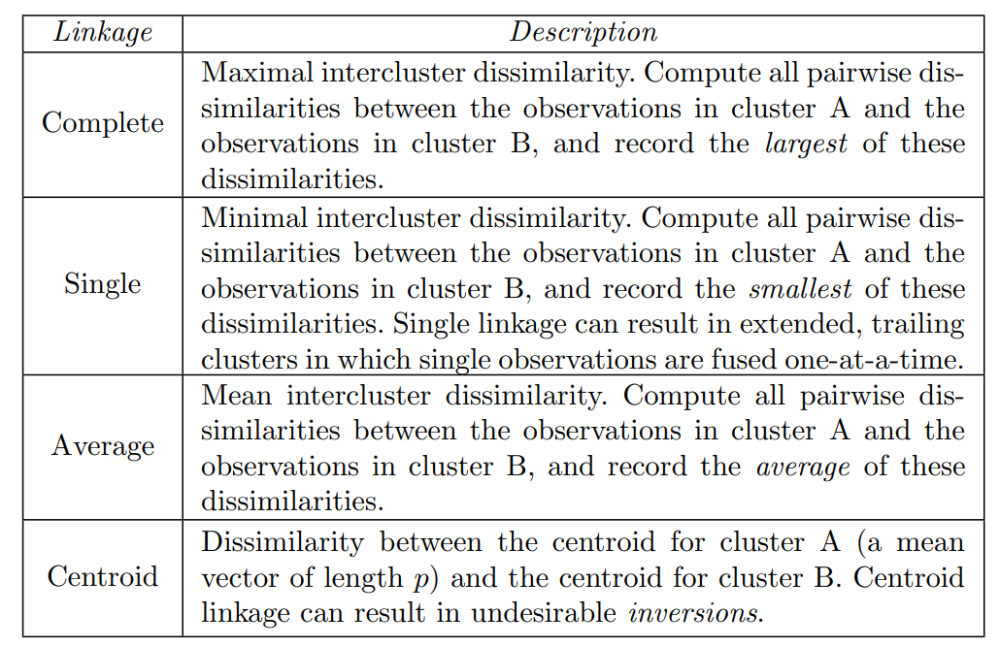

---
title: "Hierarchical Clustering"
author: <font size="5"> Son Nguyen </font>
output:
  xaringan::moon_reader:
    css: [default, metropolis, metropolis-fonts]
    lib_dir: libs
    nature:
      highlightStyle: github
      highlightLines: true
      countIncrementalSlides: false
      slideNumberFormat: |
        <div class="progress-bar-container">
          <div class="progress-bar" style="width: calc(%current% / %total% * 100%);">
          </div>
        </div>`
---

<style>

.remark-slide-content {
  background-color: #FFFFFF;
  border-top: 80px solid #F9C389;
  font-size: 17px;
  font-weight: 300;
  line-height: 1.5;
  padding: 1em 2em 1em 2em
}

.inverse {
  background-color: #696767;
  border-top: 80px solid #696767;
  text-shadow: none;
  background-image: url(https://github.com/goodekat/presentations/blob/master/2019-isugg-gganimate-spooky/figures/spider.png?raw=true);
	background-position: 50% 75%;
  background-size: 150px;
}

.your-turn{
  background-color: #8C7E95;
  border-top: 80px solid #F9C389;
  text-shadow: none;
  background-image: url(https://github.com/goodekat/presentations/blob/master/2019-isugg-gganimate-spooky/figures/spider.png?raw=true);
	background-position: 95% 90%;
  background-size: 75px;
}

.title-slide {
  background-color: #F9C389;
  border-top: 80px solid #F9C389;
  background-image: none;
}

.title-slide > h1  {
  color: #111111;
  font-size: 40px;
  text-shadow: none;
  font-weight: 400;
  text-align: left;
  margin-left: 15px;
  padding-top: 80px;
}
.title-slide > h2  {
  margin-top: -25px;
  padding-bottom: -20px;
  color: #111111;
  text-shadow: none;
  font-weight: 300;
  font-size: 35px;
  text-align: left;
  margin-left: 15px;
}
.title-slide > h3  {
  color: #111111;
  text-shadow: none;
  font-weight: 300;
  font-size: 25px;
  text-align: left;
  margin-left: 15px;
  margin-bottom: -30px;
}

</style>

```{css, echo=FALSE}
.left-code {
  color: #777;
  width: 48%;
  height: 92%;
  float: left;
}
.right-plot {
  width: 51%;
  float: right;
  padding-left: 1%;
}
```

```{r setup, include = FALSE}

# R markdown options
knitr::opts_chunk$set(echo = FALSE, 
                      
                      fig.width = 10,
                      fig.height = 5,
                      fig.align = "center", 
                      message = FALSE,
                      warning = FALSE)

# Load packages
library(tidyverse)
```

# Hierarchical clustering - Centroid Linkage

```{r}
library(tidyverse)
library(ggplot2)
library(knitr)

euc.dist = function(x1, x2){sqrt(sum((x1 - x2) ^ 2))}

# Use this example for non-unique solution
# d1 = as_tibble(data.frame(
#   x1 = c(1, 2, 3, 4, 15, 10, 11, 11, 12, 15, 11, 10, 20, 30, 25, 22, 29, 20, 31, 44, 17, 18, 19, 20), 
#   x2 = c(5, 6, 8, 8, 4,  20, 22, 27, 30, 23, 10, 15, 33, 44, 19, 14, 19, 22, 19, 20, 44, 11, 22, 37)))


d1 = as_tibble(data.frame(
     x1 = c(0,  2,  5,   9,    10,  5.5,  10), 
     x2 = c(6,    7,  9.5, 2.5,  3,   9,    4),
  cluster = c("A","B", "C",  "D",  "E", "F", "G")))
kable(d1 %>% select(cluster, x1, x2))
```

---
# Hierarchical clustering - Centroid Linkage

```{r}
row.names(d1) = d1$cluster
ggplot(data = d1, aes(x = x1, y=x2, label = cluster))+
  geom_point()+
  coord_fixed()+
  xlim(0, 10)+
  ylim(0,10)
```

---
# Label the Points

```{r}
ggplot(data = d1, aes(x = x1, y=x2, label = cluster))+
  geom_point()+
  geom_label()+
  coord_fixed()+
  xlim(0, 10)+
  ylim(0,10)
```

---
# Pair with the smallest distance.

```{r}
h_cluster <- function(dd, plot_pair = TRUE, plot_group = TRUE)
{
  m = dist(as.matrix(dd[,c(1,2)]))
  min_dist = min(m)
  m = as.matrix(m)
  ind = which(m==min_dist, arr.ind=TRUE)
  cluster_new = dd[ind[2,],] %>% select(-cluster) %>% summarise_all(mean)
  cluster_new$cluster = paste(dd$cluster[ind[2,]],collapse = '')
  r = rbind(dd[-ind[2,],],cluster_new)
  
  
  library(tidyverse)
  library(ggplot2)
  
  if(plot_pair)
  {
  p1 <-  ggplot(data = dd, aes(x = x1, y=x2, label = cluster, show.legend = FALSE))+
  geom_point()+
  geom_label()+
  coord_fixed()+
  # geom_point(data = dd[ind[2,],], aes(x=x1, y=x2),  color = 'red')+ 
  geom_label(data = dd[ind[2,],], aes(color = 'red'), show.legend = FALSE)+
  coord_fixed()+
  xlim(0, 10)+
  ylim(0,10)
  print(p1) 
  }
  
  if(plot_group)
  {
    p2 <-  ggplot(data = r, aes(x = x1, y=x2, label = cluster, show.legend = FALSE))+
  geom_point()+
  geom_label()+
  coord_fixed()
  print(p2) 
  }
  
  return(r)
}

# break downs h_cluster functions into three functions for simplicity

h_cluster2 <- function(dd)
{
   library(tidyverse)
  m = dist(as.matrix(dd[,c(1,2)]))
  min_dist = min(m)
  m = as.matrix(m)
  ind = which(m==min_dist, arr.ind=TRUE)
  cluster_new = dd[ind[2,],] %>% select(-cluster) %>% summarise_all(mean)
  cluster_new$cluster = paste(dd$cluster[ind[2,]],collapse = '')
  r = rbind(dd[-ind[2,],],cluster_new)
  return(r)
}

plot_pair <- function(dd)
{
  library(tidyverse)
  library(ggplot2)
  m = dist(as.matrix(dd[,c(1,2)]))
  min_dist = min(m)
  m = as.matrix(m)
  ind = which(m==min_dist, arr.ind=TRUE)
  
  p1 <-  ggplot(data = dd, aes(x = x1, y=x2, label = cluster, show.legend = FALSE))+
  geom_point()+
  geom_label()+
  coord_fixed()+
  # geom_point(data = dd[ind[2,],], aes(x=x1, y=x2),  color = 'red')+ 
  geom_label(data = dd[ind[2,],], aes(color = 'red'), show.legend = FALSE)+
  coord_fixed()+
  xlim(0, 10)+
  ylim(0,10)
  print(p1) 

}

plot_group <- function(dd)
{
  library(tidyverse)
  library(ggplot2)
  
  m = dist(as.matrix(dd[,c(1,2)]))
  min_dist = min(m)
  m = as.matrix(m)
  ind = which(m==min_dist, arr.ind=TRUE)
  cluster_new = dd[ind[2,],] %>% select(-cluster) %>% summarise_all(mean)
  cluster_new$cluster = paste(dd$cluster[ind[2,]],collapse = '')
  r = rbind(dd[-ind[2,],],cluster_new)
  
  p2 <-  ggplot(data = r, aes(x = x1, y=x2, label = cluster, show.legend = FALSE))+
  geom_point()+
  geom_label()+
  coord_fixed()+
  xlim(0, 10)+
  ylim(0,10)
  print(p2) 
}

h_cluster3 <- function(dd)
{
  # output the min distance for graphing
   library(tidyverse)
  m = dist(as.matrix(dd[,c(1,2)]))
  min_dist = min(m)
  return(round(min_dist,2))
}

```

```{r}
d2 <-  d1
plot_pair(d2)
```

---
# Group the pair

```{r}
plot_group(d2)
```

---
# Pair with the smallest distance.

```{r}
d2 <- h_cluster2(d2)
plot_pair(d2)
```

---
# Group the pair

```{r}
plot_group(d2)
```

---
# Pair with the smallest distance.

```{r}
d2 <- h_cluster2(d2)
plot_pair(d2)
```

---
# Group the pair

```{r}
plot_group(d2)
```

---
# Pair with the smallest distance.

```{r}
d2 <- h_cluster2(d2)
plot_pair(d2)
```

---
# Group the pair

```{r}
plot_group(d2)
```

---
# Pair with the smallest distance.

```{r}
d2 <- h_cluster2(d2)
plot_pair(d2)
```

---
# Group the pair

```{r}
plot_group(d2)
```

---
# Pair with the smallest distance.

```{r}
d2 <- h_cluster2(d2)
plot_pair(d2)
```

---
# Group the pair

```{r}
plot_group(d2)
```


---
class: middle, center, inverse
# Detail Calculation

---
# Detail Calculation

- The original data

```{r}
d_cal = d1
kable(d_cal %>% select(cluster, x1, x2))
```

---
# Detail Calculation

- Calculate all the possible pair distances 

```{r}
d = as.matrix(d_cal[,c(1,2)])
row.names(d) = d_cal$cluster

m = round(dist(d, diag = TRUE, upper = TRUE),2)

kable(as.matrix(m))
```

- Example:  $AB = \sqrt{(0-2)^2+(6-7)^2} = 2.24$

- The minimum distance is `r h_cluster3(d_cal)`

- CF has the minimum distance

- Thus, group CF into one cluster


---
# Detail Calculation

- The updated data after merging C and F

```{r}
d_cal = h_cluster2(d_cal)
kable(d_cal %>% select(cluster, x1, x2))
```

- Notice that $CF = \big(\frac{5+5.5}{2},\frac{9.5+9.0}{2}\big)=(5.25, 9.25)$

---
# Detail Calculation

- Calculate all the possible pair distances 

```{r}
d = as.matrix(d_cal[,c(1,2)])
row.names(d) = d_cal$cluster

m = round(dist(d, diag = TRUE, upper = TRUE),2)

kable(as.matrix(m))
```

- The minimum distance is `r h_cluster3(d_cal)`
- EG has the minimum distance
- Thus, group EG together

---
# Detail Calculation

- The updated data after merging EG together

```{r}
d_cal = h_cluster2(d_cal)
kable(d_cal %>% select(cluster, x1, x2))
```

---
# Detail Calculation

- Calculate all the possible pair distances 

```{r}
d = as.matrix(d_cal[,c(1,2)])
row.names(d) = d_cal$cluster

m = round(dist(d, diag = TRUE, upper = TRUE),2)

kable(as.matrix(m))
```

- The minimum distance is `r h_cluster3(d_cal)`
- D - EG has the minimum distance
- Thus, group D-EG together

---
# Detail Calculation

- The updated data after merging D-EG together

```{r}
d_cal = h_cluster2(d_cal)
kable(d_cal %>% select(cluster, x1, x2))
```

---
# Detail Calculation

- Calculate all the possible pair distances 

```{r}
d = as.matrix(d_cal[,c(1,2)])
row.names(d) = d_cal$cluster

m = round(dist(d, diag = TRUE, upper = TRUE),2)

kable(as.matrix(m))
```
- The minimum distance is `r h_cluster3(d_cal)`
- AB has the minimum distance
- Thus, group AB together

---
# Detail Calculation

- The updated data after merging AB together

```{r}
d_cal = h_cluster2(d_cal)
kable(d_cal %>% select(cluster, x1, x2))
```

---
# Detail Calculation

- Calculate all the possible pair distances 

```{r}
d = as.matrix(d_cal[,c(1,2)])
row.names(d) = d_cal$cluster

m = round(dist(d, diag = TRUE, upper = TRUE),2)

kable(as.matrix(m))
```

- The minimum distance is `r h_cluster3(d_cal)`
- CF-AB has the minimum distance
- Thus, group CF-AB together

---
# Detail Calculation

- The updated data after merging CF-AB together

```{r}
d_cal = h_cluster2(d_cal)
kable(d_cal %>% select(cluster, x1, x2))
```


---
# Detail Calculation

- There are only two clusters left

- Just need to group them together


```{r}
d_cal = h_cluster2(d_cal)
kable(d_cal %>% select(cluster, x1, x2))
```

---
# Dendrogram


---
# Problem

```{r}
d1 = as_tibble(data.frame(
     x1 = c(0,    2,  5,   9,  1), 
     x2 = c(6,    7,  9,   2,  3),
  Point = c("A","B", "C",  "D",  "E")))
kable(d1 %>% select(Point, x1, x2))
```

- Calculate H-Clustering for the data and plot the Dendrogram


```{r, echo=FALSE, eval=FALSE}
d1 = as_tibble(data.frame(
     x1 = c(0,  2,  5,  9,  1), 
     x2 = c(6,  7,  9,  2,  3),
  cluster = c("A","B", "C",  "D",  "E")))
kable(d1 %>% select(cluster, x1, x2))

row.names(d1) = d1$cluster
ggplot(data = d1, aes(x = x1, y=x2, label = cluster))+
  geom_point()+
  coord_fixed()+
  xlim(0, 10)+
  ylim(0,10)

d2 <-  d1
plot_pair(d2)
plot_group(d2)
d2 = h_cluster2(d2)
plot_pair(d2)
plot_group(d2)
d2 = h_cluster2(d2)
plot_pair(d2)
plot_group(d2)
d2 = h_cluster2(d2)
plot_pair(d2)
plot_group(d2)
d2 = h_cluster2(d2)
```


---
# Linkages


